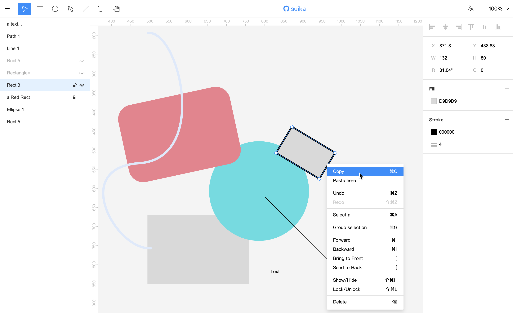

**Suika Graphics Editor**, an open-source vector graphics editor based on Canvas, similar to Figma.

**suika 图形编辑器**，一款开源的基于 Canvas 实现的矢量图形编辑器，类似 Figma。

English | [中文](./README_zh.md)

[Experience](https://f-star.github.io/suika/)



## Features

1. Creation and editing of graphics, including: rounded rectangle, ellipse, line, path, text, polygon, star;
2. Path editing using the pen tool, adjusting control points;
3. Support tools: selection tool, graphics drawing tools, image tool, pen tool, canvas tool, hand tool;
4. Infinite canvas, with zoom and pan capabilities;
5. Multiple pages support;
6. History, with undo and redo;
7. i18n;
8. Snap support, currently supports pixel grid snap and graphics guide snap;
9. Keyboard shortcuts;
10. Copy and paste, supports cross-canvas copy and paste, alignment, and arrangement;
11. Layers panel, properties panel;
12. Group, Frame;
13. Multi-user collaborative editing (requires backend implementation);
14. Ruler;
15. Import and export JSON data;
16. User settings;

## Documentation

WIP.

## Environment Dependencies

To run the project, you need to install Node.js (it is recommended to use the LTS version from the official website), then use Node.js to install the PNPM package manager:

```sh
npm install -g pnpm
```

## Install

```sh
pnpm install
```

## Dev

```sh
pnpm run dev
```

## Build

```sh
pnpm build
```

The target output folder is `apps/suika/build`.

## Icon

[figma design](https://www.figma.com/community/file/1224385128783567603/suika-icons)

## About Multi-User Collaboration

The frontend implementation logic for collaboration is located in the `@suika/suika-multiplayer` package. This package copies `@suika/suika` (pure client-side) and adds multi-user collaboration logic, such as multiple cursors, and calls some interfaces, like getting the drawing name and current user information.

Multi-user collaboration is implemented using yjs and the hocuspocus library (a further wrapper around yjs).

If you want to implement multi-user collaboration, you need to implement backend RESTful API services that this package uses, and provide WebSocket services based on hocuspocus.

Additionally, you need to implement a frontend workspace project to manage drawings, supporting login, registration, creating drawings, opening drawings, deleting drawings, and authorization.
